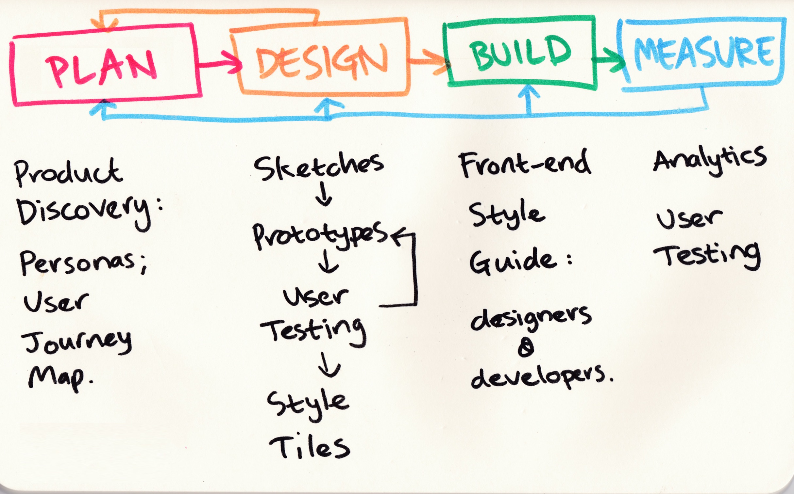

# Front-end-Narrative

Ideas for a Front-end narrative for codeXers

## Feedback from intro session

Things the codeXers want to know.

* UX basics
  * Journey maps
  * Story maps
  * Prototypes
  * How to translate something into a layout
* Where to start with layout, etc.
* How to use Bootstrap effectively
* How to not use default stuff
* JavaScript patterns
  * best practice
  * unobtrusive
* Web app patterns
  * MVC, etc.
* Hamburger icons  

## UCD process

* Plan
  * Product Discovery
    * Personas
    * User Journey Map
* Design
  * Sketches
  * Prototypes
  * User Testing
  * Style Tiles
* Build
  * Front-end Style Guide
* Measure
  * Analytics
  * User Testing
